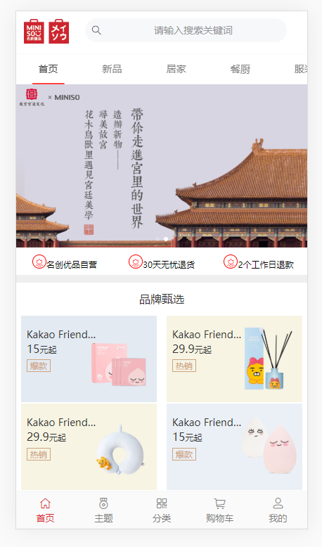
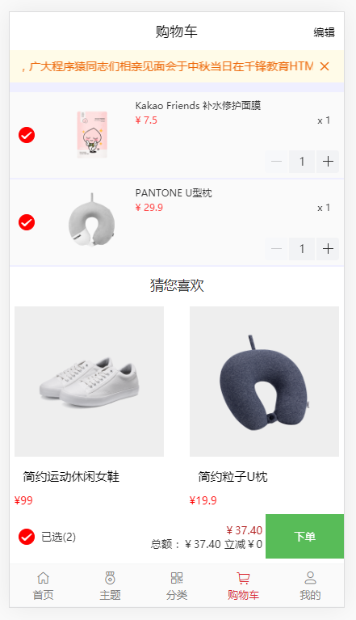
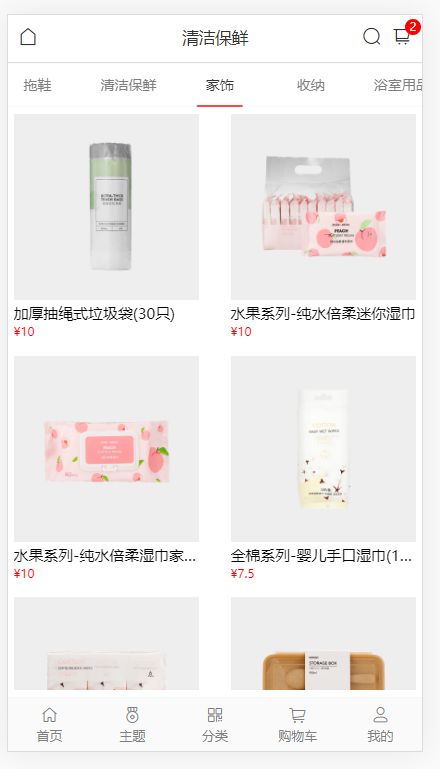

# 项目说明
	基于Vue框架的webApp项目 + 后台管理系统
	
## 项目类型
* 电商
## 项目要求
* 项目名称 ：名创优品
* 演示
	* 官网  (http://m.miniso.cn/wap/index.html)
	* 上线地址  (http://47.100.118.206:1906)
	* 后台地址  (http://47.100.118.206:1907)
	* git仓库地址   (https://github.com/gzh51906/mingchuangyoupin)
* 团队分工
	* 组长：陈炜   成员 ： 黄林芳  王佳伟
	* 黄林芳：负责的是首页页面的搭建，后台管理系统操作商品数据修改编辑和上新
	* 王佳伟：负责的是分类列表页的数据渲染，详情页和购物车功能和逻辑
	* 陈炜：负责的是专题页的静态渲染，我的静态页面和登录页注册页的数据获取和逻辑实现
* 
	
	
	
>tree
|-- package-lock.json
|-- package.json
|-- api
|   |-- config.json
|   |-- db
|   |   `-- mysql.js
|   |-- index.html
|   |-- router
|   |   |-- classifiaction.js
|   |   |-- classify.js
|   |   |-- detialsjw.js
|   |   |-- home.js
|   |   |-- index.js
|   |   |-- login.js
|   |   |-- reg.js
|   |   |-- rms.js
|   |   |-- searchjw.js
|   |   |-- special.js
|   |   `-- usercart.js
|   |-- server.js
|   `-- utils
|       `-- index.js
|-- public
|   |-- 1567737173.png
|   |-- favicon.ico
|   `-- index.html
`-- src
    |-- App.vue
    |-- assets
    |   `-- logo.png
    |-- busforjw.js
    |-- childcomponents
    |   |-- classify
    |   |   |-- Details.vue
    |   |   |-- classification.vue
    |   |   `-- search.vue
    |   `-- home
    |       |-- Classifys.vue
    |       `-- Homeson.vue
    |-- components
    |   |-- Cart.vue
    |   |-- Classify.vue
    |   |-- Home.vue
    |   |-- Login.vue
    |   |-- My.vue
    |   |-- Reg.vue
    |   `-- Special.vue
    |-- images
    |   |-- 1-1P3131F2180-L.jpg
    |   |-- db4828be9abfbb1ef95e8b9e7028aa30.png
    |   `-- timg.jpg
    |-- main.js
    |-- router
    |   `-- index.js
    |-- static
    |   |-- jquery-3.4.1.js
    |   |-- md5.js
    |   `-- rem.js
    `-- store
        |-- cart.js
        `-- index.js

## 技术栈

### 前端 
* Vue
* Vuex
* Vue-Router
* Vue-Cli
* axios
* elementUI/MintUI/vant/NutUi
* git

### 后端
* NodeJs
* Express
* MySQL